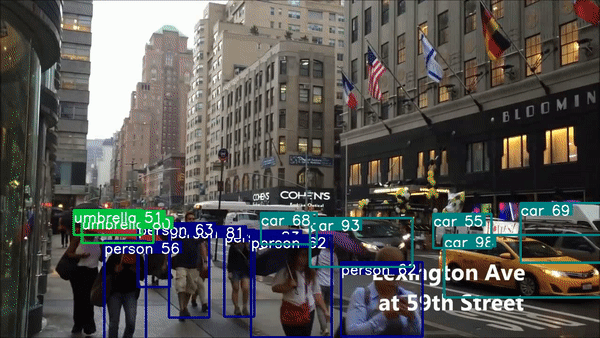

# Efficient networks for Computer Vision

This repo contains source code of our work on designing efficient networks for different computer vision tasks: <span style="color:blue"> (1) Image classification, (2) Object detection, and (3) Semantic segmentation.</span>
 
<table>
    <tr>
        <td colspan=2 align="center"><b>Real-time object detection using ESPNetv2<b></td>
    </tr>
    <tr>
        <td colspan=2 align="center">
            </img>
        </td>
    <tr>
        <td>
            </img>
        </td>
        <td>
            </img>
        </td>
    </tr>
</table>

    
**Table of contents**
 1. [Key highlihgts](#key-highlights)
 2. [Supported networks](#supported-networks)
 3. [Relevant papers](#relevant-papers)
 4. [Blogs](#blogs)
 5. [Performance comparison](#performance-comparison)
 6. [Training receipe](#training-receipe)
 7. [Citation](#citation)
 8. [License](#license)
 9. [Acknowledgements](#acknowledgements)
    
## Key highlights
 * Object classification on the ImageNet and MS-COCO (multi-label)
 * Semantic Segmentation on the PASCAL VOC and the CityScapes
 * Object Detection on the PASCAL VOC and the MS-COCO
 * Supports PyTorch 1.0
 * Integrated with Tensorboard for easy visualization of training logs. 
 * Scripts for downloading different datasets.

## Supported networks
This repo supports following networks:
 * ESPNetv2 (Classification, Segmentation, Detection)
 * DiCENet (Classification, Segmentation, Detection)
 * ShuffleNetv2 (Classification)
 

## Relevant papers
 * [ESPNet (ECCV'18)](https://arxiv.org/abs/1803.06815)
 * [ESPNetv2 (CVPR'19)](https://arxiv.org/abs/1811.11431)
 * [DiCENet (arxiv)](https://arxiv.org/pdf/1906.03516.pdf)
 
## Blogs

 * [Faster Training for Efficient Networks](https://medium.com/p/faster-training-of-efficient-cnns-657953aa080?source=email-dc17ff22fa63--writer.postDistributed&sk=f60110289b6157de4c9e0c00c77f51e9)
 * [Semantic segmentation using ESPNetv2](https://medium.com/@sachinmehta.ngb/espnetv2-for-semantic-segmentation-9e80f155d522?source=friends_link&sk=91bca9326b088a972c170d1f7f5063e8)
 
## Performance comparison

### ImageNet
Below figure compares the performance of DiCENet with other efficient networks on the ImageNet dataset. DiCENet outperforms all existing efficient networks, including MobileNetv2 and ShuffleNetv2. More details [here](model/classification/model_zoo/README.md)


### Object detection

Below table compares the performance of our architecture with other detection networks on the MS-COCO dataset. Our network is fast and accurate. More details [here](model/detection/model_zoo/README.md)

<table>
    <tr>
        <td></td>
        <td colspan=3 align="center"> <b>MSCOCO</b></td>
    </tr>
    <tr>
        <td></td>
        <td align="center"> <b>Image Size</b> </td>
        <td align="center"> <b>FLOPs</b> </td>
        <td align="center"> <b>mIOU</b> </td>
        <td align="center"> <b>FPS</b> </td>
    </tr>
    <tr>
        <td> SSD-VGG</td>
        <td align="center"> 512x512 </td>
        <td align="center"> 100 B</td>
        <td align="center"> 26.8 </td>
        <td align="center"> 19 </td>
    </tr>
    <tr>
        <td> YOLOv2</td>
        <td align="center"> 544x544 </td>
        <td align="center"> 17.5 B</td>
        <td align="center"> 21.6 </td>
        <td align="center"> 40 </td>
    </tr>
    <tr>
        <td> ESPNetv2-SSD (Ours) </td>
        <td align="center"> 512x512 </td>
        <td align="center"> 3.2 B</td>
        <td align="center"> 24.54 </td>
        <td align="center"> 35 </td>
    </tr>
</table>


### Semantic Segmentation

Below figure compares the performance of ESPNet and ESPNetv2 on two different datasets. Note that ESPNets are one of the first efficient networks that delivers competitive performance to existing networks on the PASCAL VOC dataset, even with low resolution images say 256x256. See [here](model/segmentation/model_zoo/README.md) for more details.

<table>
    <tr>
        <td></td>
        <td colspan=3 align="center"> <b>Cityscapes</b></td>
        <td colspan=3 align="center"> <b>PASCAL VOC 2012</b> </td>
    </tr>
    <tr>
        <td></td>
        <td align="center"> <b>Image Size</b> </td>
        <td align="center"> <b>FLOPs</b> </td>
        <td align="center"> <b>mIOU</b> </td>
        <td align="center"> <b>Image</b> Size </td>
        <td align="center"> <b>FLOPs</b></td>
        <td align="center"> <b>mIOU</b> </td>
    </tr>
    <tr>
        <td> ESPNet</td>
        <td align="center"> 1024x512 </td>
        <td align="center"> 4.5 B</td>
        <td align="center"> 60.3 </td>
        <td align="center"> 512x512 </td>
        <td align="center"> 2.2 B</td>
        <td align="center"> 63 </td>
    </tr>
    <tr>
        <td> ESPNetv2</td>
        <td align="center"> 1024x512 </td>
        <td align="center"> 2.7 B</td>
        <td align="center"> <b>66.2</b> </td>
        <td align="center"> 384x384 </td>
        <td align="center"> 0.76 B</td>
        <td align="center"> <b>68</b> </td>
    </tr>
</table>

## Training Receipe

### Image Classification
Details about training and testing are provided [here](README_Classification.md).

Details about performance of different models are provided [here](model/classification/model_zoo/README.md).

### Semantic segmentation
Details about training and testing are provided [here](README_Segmentation.md).

Details about performance of different models are provided [here](model/segmentation/model_zoo/README.md).


### Object Detection

Details about training and testing are provided [here](README_Detection.md).

Details about performance of different models are provided [here](model/detection/model_zoo/README.md).

## Citation
If you find this repository helpful, please feel free to cite our work:
```
@misc{mehta2019dicenet,
Author = {Sachin Mehta and Hannaneh Hajishirzi and Mohammad Rastegari},
Title = {DiCENet: Dimension-wise Convolutions for Efficient Networks},
Year = {2019},
Eprint = {arXiv:1906.03516},
}

@inproceedings{mehta2018espnetv2,
  title={ESPNetv2: A Light-weight, Power Efficient, and General Purpose Convolutional Neural Network},
  author={Mehta, Sachin and Rastegari, Mohammad and Shapiro, Linda and Hajishirzi, Hannaneh},
  booktitle={Proceedings of the IEEE conference on computer vision and pattern recognition},
  year={2019}
}

@inproceedings{mehta2018espnet,
  title={Espnet: Efficient spatial pyramid of dilated convolutions for semantic segmentation},
  author={Mehta, Sachin and Rastegari, Mohammad and Caspi, Anat and Shapiro, Linda and Hajishirzi, Hannaneh},
  booktitle={Proceedings of the European Conference on Computer Vision (ECCV)},
  pages={552--568},
  year={2018}
}
```

## License
By downloading this software, you acknowledge that you agree to the terms and conditions given [here](License).


## Acknowledgements
Most of our object detection code is adapted from [SSD in pytorch](https://github.com/amdegroot/ssd.pytorch). We thank authors for such an amazing work.

